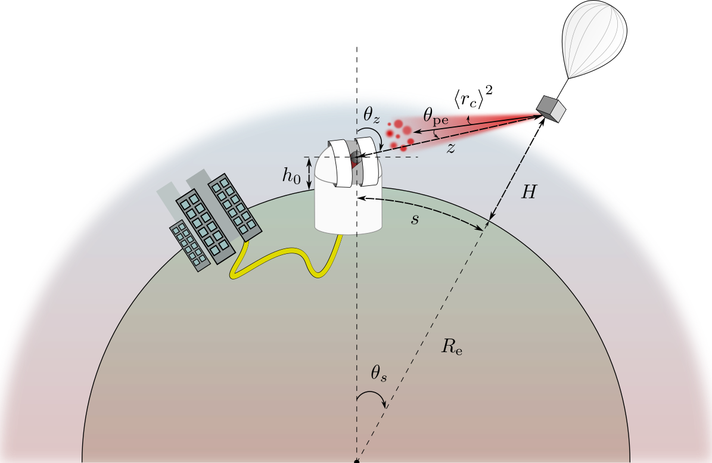

# balloon_qnet

Repository containing Netsquid simulator of balloon-based quantum networks including downlink, uplink and horizontal free-space channels. 



## Article

The article assosciated to this repository can be currently found on arXiv, under the name [Free-space model for balloon-based quantum networks (arXiv:2412.03356)](https://arxiv.org/abs/2412.03356). 

If you are planning to use this code or data in your research, please cite:

```
@misc{karakostaamarantidou2024freespacemodelballoonbasedquantum,
      title={Free-space model for a balloon-based quantum network}, 
      author={Ilektra Karakosta-Amarantidou and Raja Yehia and Matteo Schiavon},
      year={2024},
      eprint={2412.03356},
      archivePrefix={arXiv},
      primaryClass={quant-ph},
      url={https://arxiv.org/abs/2412.03356}, 
}
```

## Installation

`balloon_qnet` uses the [NetSquid](https://netsquid.org/) Python package. To install and use NetSquid, you need to first create an account.

Please take note that NetSquid only supports Linux and MacOS. For Windows users it is recommended to either use a virtual machine or use [Windows Subsystem for Linux (WSL)](https://learn.microsoft.com/en-us/windows/wsl/install).

To run these function the following has to be installed:

- Python version 3.9 at most
- Netsquid, Quantum Network simulation tool, https://netsquid.org/
- Lowtran from https://github.com/francescopiccia/lowtran-piccia

## License

This project is licensed under the MIT License. See the `LICENSE` file for details.